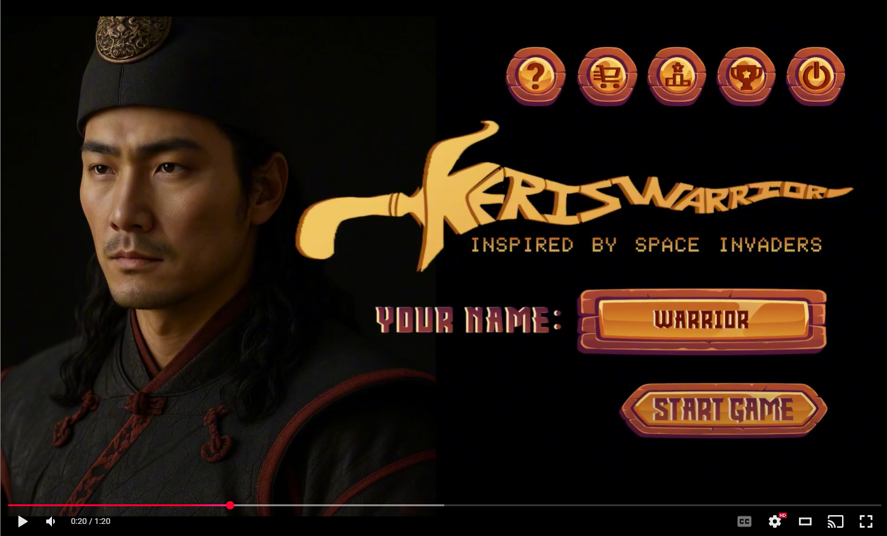

# KerisWarrior (C# / Unity)

My game development group project in University Teknologi Malaysia (UTM), a game build in Unity feature 3D designs for classic game which is Space Invader for my group. My role is game designer and I confirmed the game theme and gameflow. I also act as second game programmer to assist my other teammate to do the bug fixing and enhancement.

# Features
- Space Invader but in 3D
- Shop system
- Leaderboard system
- Powerup system to assist the warrior
- Achievement system
- VR support

# Teaser

# Gameplay

